# 🚀 DevSecOps CI/CD Pipeline with GitHub Actions

<div align="center">

[](https://sonarcloud.io/)
[](https://trivy.dev/)
[](https://gitleaks.io/)
[](https://www.docker.com/)
[](https://ghcr.io/)
[](https://www.npmjs.com/)
[](https://vite.dev/)
[](https://kubernetes.io/)
[](https://argoproj.github.io/cd/)

</div>

A comprehensive DevSecOps implementation showcasing a complete CI/CD pipeline with integrated security scanning, code quality analysis, and automated deployment using GitHub Actions, SonarCloud, and Kubernetes.

## 🏗️ Pipeline Architecture


This DevSecOps pipeline implements a comprehensive security-first approach with the following stages. For comprehensive pipeline documentation and workflow details **[.github/README.md](./.github/README.md)**

### 🔄 Pipeline Flow
1. **Source Control** - Developer commits trigger the pipeline
2. **Pre-Build Security** - Secrets scanning (Gitleaks) and dependency/IaC scanning (Trivy FS)
3. **Code Validation** - Unit testing with comprehensive test coverage
4. **Static Code Quality** - SonarCloud analysis with quality gate enforcement
5. **Build & CI Artifacts** - Application build and artifact upload
6. **Container Build & Security** - Docker image creation with Trivy image scanning and pushing to GHCR
7. **Continuous Delivery** - Automated Kubernetes manifest updates for GitOps deployment

## 🎮 Application Overview


<details>
<summary>🚀 <strong>Getting Started</strong></summary>

## Tech Stack

This project features a modern **React-based Tic-Tac-Toe game** built with:
- **React 18** with TypeScript for type safety
- **Tailwind CSS** for responsive styling
- **Vite** for fast development and optimized builds
- **Vitest** for comprehensive unit testing
- **ESLint** for code quality enforcement

## 🔧 Getting Started

### Prerequisites

- **Node.js** (v18 or higher)
- **npm** or **yarn**
- **Docker** (for containerization)
- **kubectl** (for Kubernetes deployment)

### 📦 Installation

1. **Clone the repository:**
   ```bash
   git clone https://github.com/atkaridarshan04/devsecops-github-actions.git
   cd devsecops-github-actions
   ```

2. **Install dependencies:**
   ```bash
   npm install
   # or
   yarn install
   ```

3. **Start the development server:**
   ```bash
   npm run dev
   # or
   yarn dev
   ```

4. **Open your browser and navigate to:**
   ```
   http://localhost:5173
   ```

### 🏗️ Building for Production

To create a production build:

```bash
npm run build
# or
yarn build
```

The build artifacts will be stored in the `dist/` directory.

### 🧪 Running Tests

Execute the test suite:

```bash
npm test
# or
yarn test
```

### 🐳 Docker Deployment

Build and run the application using Docker:

```bash
# Build the Docker image
docker build -t tic-tac-toe-app .

# Run the container
docker run -p 80:80 tic-tac-toe-app
```

</details>

## Implementation Steps

### 1. Clone Repository

```bash
git clone https://github.com/atkaridarshan04/devsecops-github-actions.git
cd devsecops-github-actions
```
---

<details>
<summary><strong>2. SonarCloud Setup</strong></summary>

### Step 1: Create SonarCloud Project

1. **Navigate to SonarCloud** and create a new project:

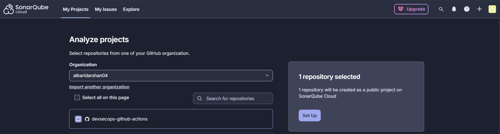

2. **Configure new code definition** - Select "Previous version" for projects following regular versions or releases.

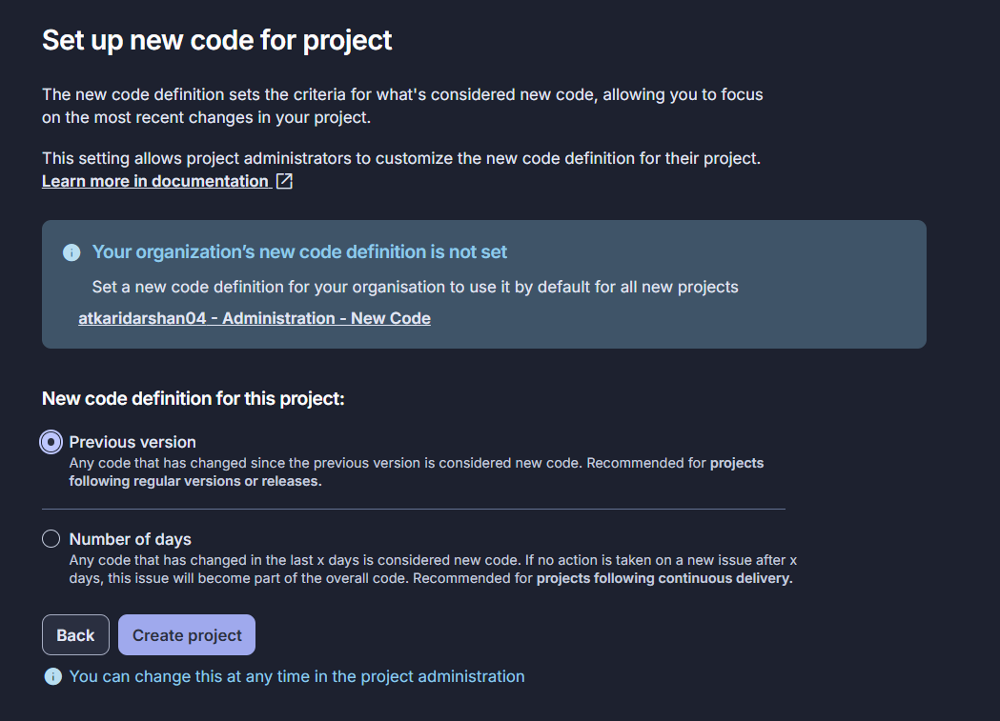

---

### Step 2: Generate Authentication Token

1. **Go to Security settings** in your SonarCloud account:

2. **Generate a new token** with appropriate permissions for your CI/CD pipeline.

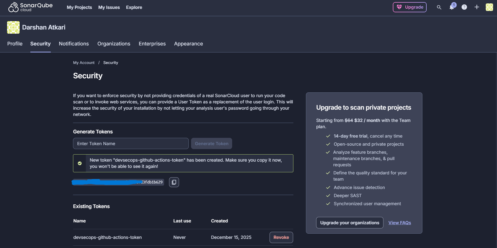

---

### Step 3: Configure Project and Organization Keys

#### Project Key Configuration:
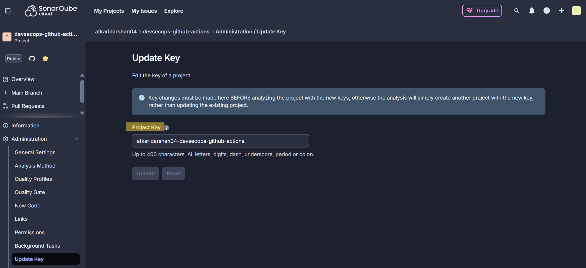

#### Organization Key Setup:
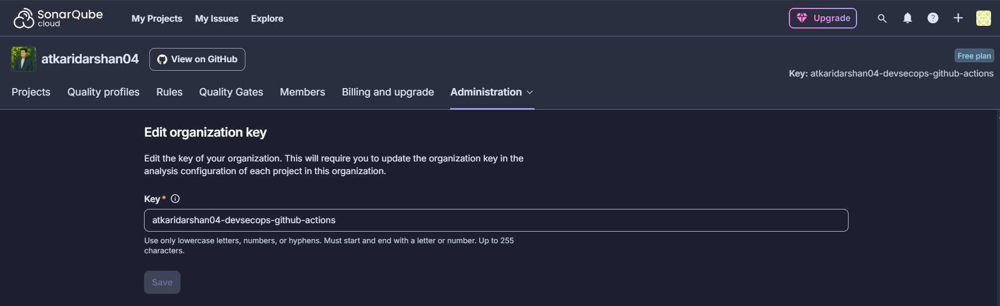

### Step 4: Project Information Overview

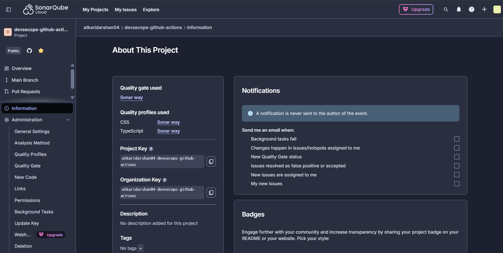

The project information page shows:
- **Quality Gate**: Sonar way (default)
- **Quality Profiles**: CSS and TypeScript using Sonar way
- **Project Key**: `atkaridarshan04-devsecops-github-actions`
- **Organization Key**: `atkaridarshan04-devsecops-github-actions`

---

### Step 5: Configure sonar-project.properties

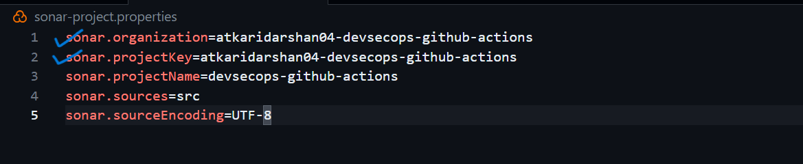

Ensure to update your `sonar-project.properties` file with the correct project and organization configurations.

---

### Step 6: Disable Automatic Analysis for CI/CD

**Important**: For CI/CD integration, disable automatic analysis:

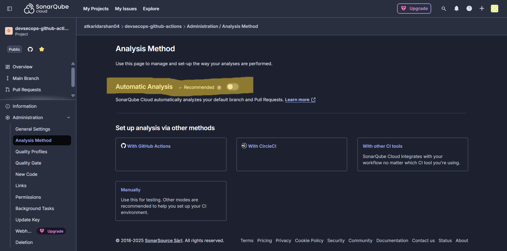

1. Go to **Administration** → **Analysis Method**
2. **Disable Automatic Analysis** 
3. Select **"With GitHub Actions"** for CI integration

> **Note**: Let the project run with automatic analysis initially to establish a baseline, then disable it for CI/CD integration to avoid conflicts.

</details>

---

<details>
<summary><strong>3. GitHub Token & Secrets Setup</strong></summary>

### Create GitHub Personal Access Token
- Go to **Settings** → **Developer settings** → **Personal access tokens** → **Tokens (classic)**
- Generate new token with permissions:
  - `contents: write` (for updating Kubernetes manifests)
  - `packages: write` (for pushing to GitHub Container Registry)
  - `actions: read` (for workflow access)

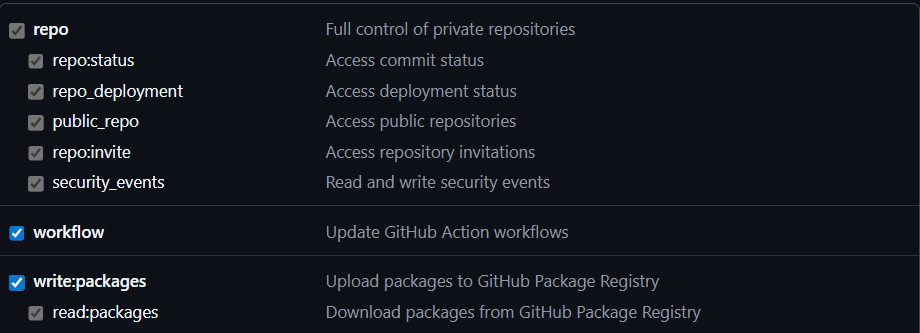

### Add Repository Secrets
- Go to your repository **Settings** → **Secrets and variables** → **Actions**
- Add the following secrets:
  ```
  SONAR_TOKEN=your_sonarcloud_token_here
  GH_TOKEN=your_github_personal_access_token
  ```

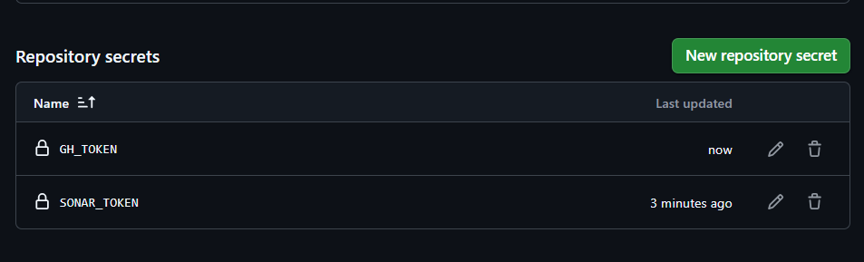

</details>

---

### 4. Run Pipeline

**Make a change and push to main branch or start the workflow manually**

Monitor execution in GitHub Actions tab and verify all security scans pass.
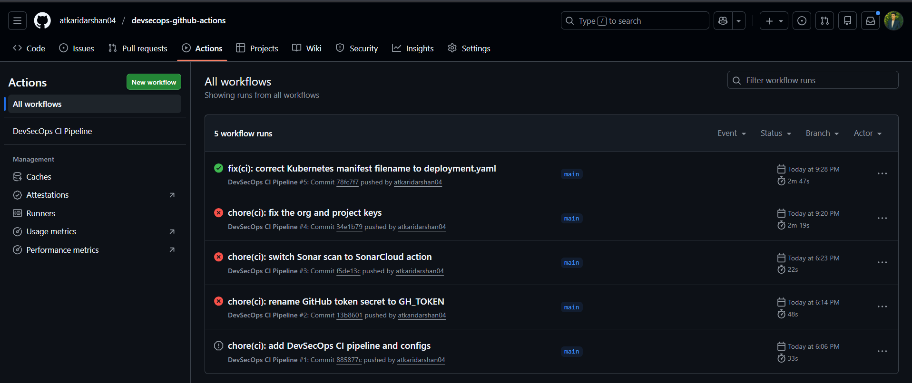

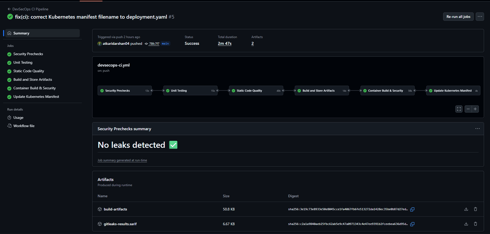
---

### 5. Verify Analysis Results

Head over to SonarCloud to review the analysis results. 
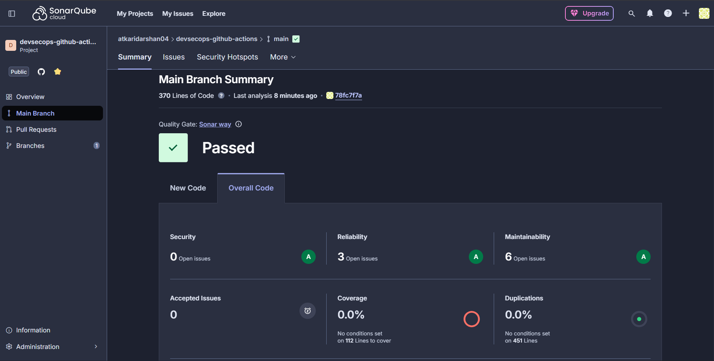

---

### 6. Kubernetes Deployment

You can further configure GitOps deployment using ArgoCD or FluxCD to automate application deployment to your Kubernetes cluster.


## 📄 License

This project is licensed under the MIT License - see the [LICENSE](LICENSE) file for details.

---

<div align="center">

**Built with ❤️ for DevSecOps Excellence**
<br>
**⭐ Star this repository if you find it helpful!**
</div>
