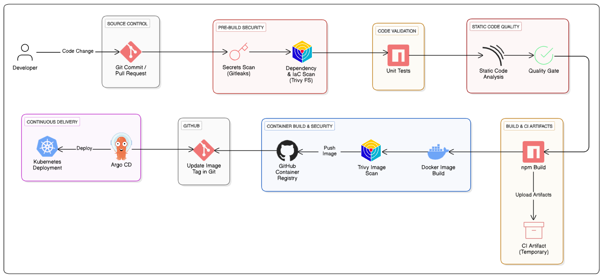

# GitHub Actions DevSecOps Pipeline Implementation

## Pipeline Architecture


## Application Overview


## Getting Started

### Prerequisites

- Node.js (v14 or higher)
- npm or yarn

### Installation

1. Install dependencies:
   ```bash
   npm install
   # or
   yarn
   ```

2. Start the development server:
   ```bash
   npm run dev
   # or
   yarn dev
   ```

3. Open your browser and navigate to `http://localhost:5173`

## Building for Production

To create a production build:

```bash
npm run build
# or
yarn build
```

The build artifacts will be stored in the `dist/` directory.

